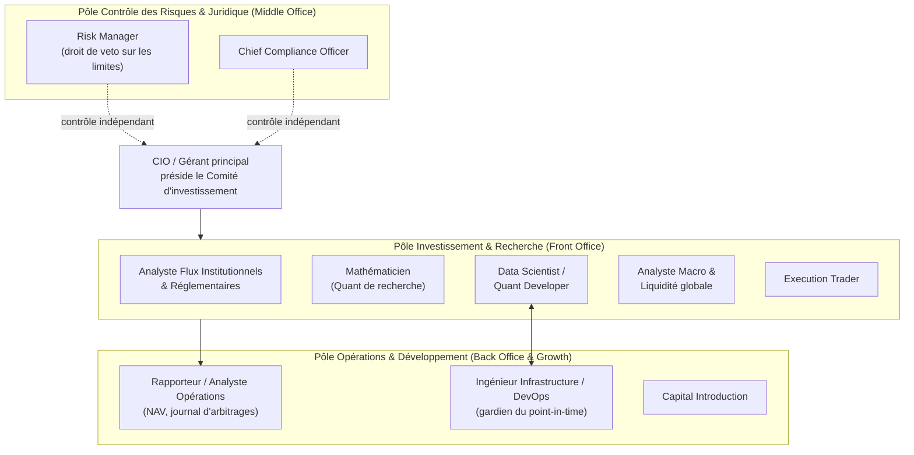
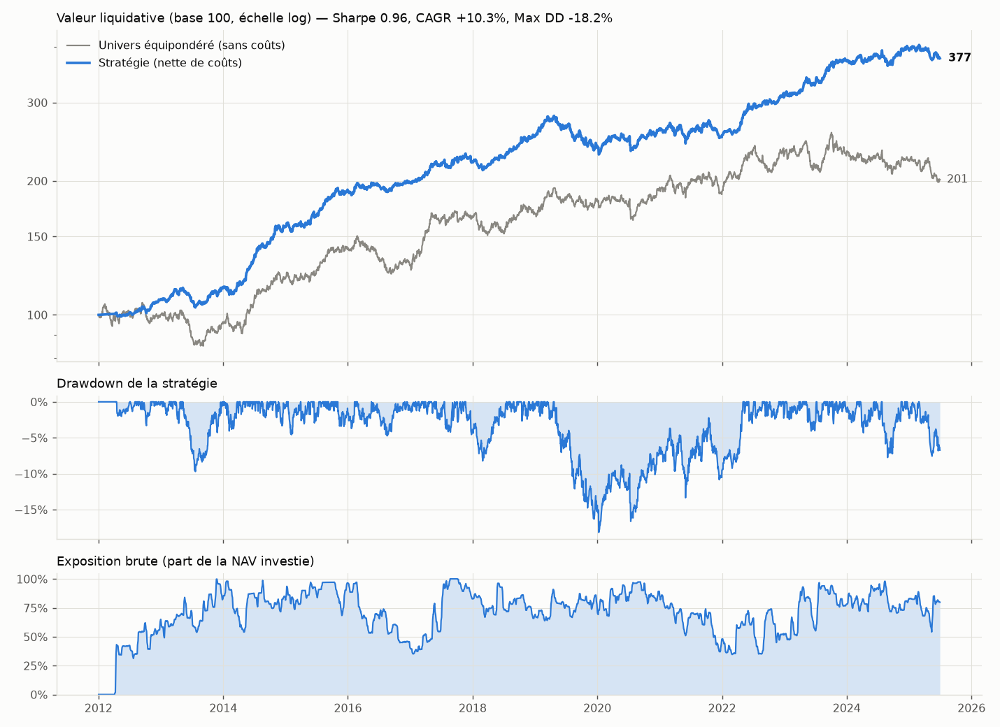

# Synthèse managériale — Fonds « Moyen/Long-Term Flow Trading »
*Smart Money & Exit Management — organisation, protocole de revue, architecture et backtest*

| | |
|---|---|
| **Rédigé par** | Direction de la Technologie (CTO) et Direction des Investissements (CIO) |
| **Version** | v1.3 — 23/09/2026 — décisions des fondateurs (§9) ; empreinte des grands acteurs (§1.3) ; radar heure / jour / semaine / mois (§1.4) ; serveur MCP (§4.4) ; fiches de trade et « Desk Smart Money » (§4.5) |
| **Livrables associés** | `backtest/flow_backtest.py` (moteur de backtest), `backtest/smart_money.py` (liste Smart Money, flux à budget nul), `backtest/market_footprint.py` (empreinte prix / volume), `backtest/institutional_radar.py` (radar des grands acteurs), `backtest/trade_cards.py` (fiches de trade), `backtest/dashboard.py` (page « Desk Smart Money »), `backtest/phase1_data.py` (données réelles gratuites), `backtest/tradingview_bridge.py`, `tradingview/` (intégration TradingView), `mcp_server/` (serveur MCP du fonds), `tests/` (57 tests) |

---

## 0. L'essentiel en une page

**Verdict : l'organisation est validée, sous cinq conditions** (§2.3). La plus importante : il manque aujourd'hui un **décideur final**. Les analystes recommandent et le Risk Manager valide, mais personne n'arbitre. Il faut un CIO / gérant qui préside un comité d'investissement hebdomadaire.

**La stratégie en une phrase.** On achète quand deux sources indépendantes montrent que les grandes institutions accumulent un actif, et que le marché ne montre pas l'inverse :
- une source **lente mais précise**, le *positionnement* (13F, COT, on-chain) ;
- une source **rapide mais bruitée**, les *flux de fonds* (ETF, EPFR, ETP) ;
- une troisième source, **l'empreinte des grands acteurs** (banques, institutions) dans le prix et le volume, qui interdit d'acheter pendant une distribution visible (§1.3).

On vend par paliers quand ces sources se retournent : une seule en alerte, on allège ; deux sur trois, on sort. Les stop-loss de prix restent un garde-fou séparé, confié au Risk Manager.

**Pourquoi l'Exit Management est le cœur du dispositif, et pas un accessoire.** La jambe lente arrive en retard par construction : un 13F est publié jusqu'à 45 jours après la fin du trimestre. Sans jambe rapide, le fonds découvrirait une distribution institutionnelle avec 2 à 4 mois de retard. C'est ce qui justifie :
- la sortie à trois niveaux (§3.4) ;
- la revue obligatoire de 100 % des lignes (§3.1).

**Ce que le backtest démontre aujourd'hui.** La *mécanique* est correcte, sur un jeu de données synthétique :
- aucune information n'est utilisée avant sa date de publication légale, ce qui est prouvé par un test de perturbation du futur ;
- les sorties se déclenchent comme spécifié ;
- les métriques de risque sont calculées et testées.

**Ce qu'il ne démontre pas encore.** La performance *réelle*. Cela exige les données 13F / EPFR / COT historiques en point-in-time : c'est la phase 1 de la feuille de route (§8).

**TradingView** devient la **couche visuelle et collaborative** de l'équipe (§4.3). Ce n'est pas la source des signaux, car TradingView ne fournit ni 13F, ni EPFR, ni COT sous une forme exploitable en backtest.

**Décisions prises le 23/09/2026** (§9) : acheteur uniquement, liste Smart Money, premier test sur les actions US avec des données gratuites, profil de risque équilibré, TradingView gratuit. Les choix techniques relèvent désormais de l'équipe, qui les documente au §9.

---

## 1. Thèse d'investissement et source d'avantage

### 1.1 Pourquoi suivre les flux institutionnels à moyen/long terme

1. **Les grandes institutions ne peuvent pas construire une position en un jour.** Une position de plusieurs centaines de millions se bâtit par fractions sur des semaines ou des mois pour limiter l'impact de marché. L'accumulation est donc **persistante et observable** avant d'être terminée.
2. **Les flux de fonds contraignent les gérants.** Un fonds qui reçoit des souscriptions doit acheter ; un fonds qui subit des rachats doit vendre. Coval & Stafford (2007, *Journal of Financial Economics*) documentent les pressions de prix liées à ces achats et ventes forcés. Lou (2012, *Review of Financial Studies*) montre que les échanges induits par les flux prédisent les rendements, puis se retournent partiellement à plus long terme.
3. **Les institutions se suivent entre elles** (*herding* : Sias, 2004, *Review of Financial Studies*). Le signal se renforce donc tant que le flux dure.
4. **Répliquer les 13F peut fonctionner malgré le délai** : c'est l'objet de la littérature sur les *copycat funds* (Frank, Poterba, Shackelford & Shoven, 2004, *Journal of Law and Economics*).

**Corollaire.** La pression des flux finit par s'inverser (point 2). Sortir tôt compte donc autant qu'entrer tôt. La section 3 est construite autour de cette asymétrie.

### 1.2 Deux jambes complémentaires, applicables à toutes les classes d'actifs

| | Jambe lente : **positionnement** | Jambe rapide : **flux de fonds** |
|---|---|---|
| Question posée | Les institutions de référence détiennent-elles plus ou moins l'actif ? | L'argent entre-t-il ou sort-il des véhicules qui l'achètent ? |
| Qualité | Précise, nominative, mais **tardive** | Immédiate, mais **bruitée** |
| Actions | Form 13F (trimestriel, +45 j), 13D/G, Form 4 | Flux des ETF sectoriels, EPFR |
| Devises | CFTC COT — Asset Managers / Leveraged Funds (hebdo, +3 j) | Flux EPFR par pays, positionnement sur contrats à terme |
| Matières premières | CFTC COT — Managed Money (hebdo, +3 j) | Flux et stocks des ETC/ETF (ex. tonnage des ETF or) |
| Crypto | On-chain : offre des Long-Term Holders, wallets institutionnels (J+1) | Flux des ETP/ETF spot, netflows des exchanges |
| Rôle dans les décisions | **Valide** la thèse (entrée) et **l'invalide** (sortie) | **Confirme** l'entrée et **alerte en premier** à la sortie |

### 1.3 Troisième jambe : l'empreinte des grands acteurs dans le prix et le volume

**Demande des fondateurs : suivre aussi les banques sur les marchés, en regardant où elles sont à travers le prix et le volume.** Les grands acteurs ne peuvent pas cacher leur volume. Là où ils achètent ou vendent massivement, le marché en garde la trace, chaque jour et sans délai de publication.

| Mesure | Ce qu'elle montre | Lecture |
|---|---|---|
| **Profil de volume sur 6 mois** : zone de valeur (70 % du volume) et prix le plus échangé | Le prix auquel les grands acheteurs ont constitué leurs positions : la meilleure estimation publique de leur prix de revient | Cours au-dessus de la zone : ils sont en gain et la défendent. En dessous : ils sont en perte, et les sorties commencent souvent. |
| **VWAP sur 63 séances** | Le prix moyen payé par les acheteurs du dernier trimestre | Cours au-dessus : les acheteurs récents gagnent de l'argent. |
| **Volume des hausses / volume des baisses** (50 séances) | Qui domine : acheteurs ou vendeurs | ≥ 1,15 avec un cours au-dessus du VWAP : **accumulation**. |
| **Jours de distribution** (25 séances) : baisse ≥ 0,2 % sur un volume ≥ 1,2 × la moyenne | Les ventes lourdes des grands acteurs (règle de W. O'Neil, durcie pour les actions individuelles) | 5 ou plus : **distribution**. Même chose si le ratio ≤ 0,85 et le cours sous la zone de valeur. |

**Place dans les décisions :**
- **à l'achat**, une empreinte vendeuse interdit d'entrer, et une empreinte acheteuse fait passer le candidat devant les autres ;
- **à la vente**, c'est une jambe à part entière : avec les flux de fonds, elle peut confirmer une distribution **sans attendre le 13F suivant** (jusqu'à 4 mois et demi de retard).

**Données nominatives sur les banques (gratuites, à intégrer en phase 1) :**
- **rapport COT de la CFTC**, catégorie « Dealer / Intermediary », qui regroupe essentiellement les banques sur les contrats à terme de devises, de taux et d'indices ;
- **volumes des plateformes alternatives (« dark pools »)** publiés par la FINRA, titre par titre, avec quelques semaines de délai ;
- **13F des banques elles-mêmes** (JPMorgan, Goldman Sachs…), déjà lus par le moteur.

**Honnêteté sur les limites.**
- Le prix et le volume montrent la *pression* des grands acteurs, pas leur *identité*.
- Une grande partie du volume des banques est de la tenue de marché couverte : ce n'est pas un pari.
- Les méthodes populaires qui prétendent lire les ordres des banques sur un graphique (« order blocks », « liquidity grabs ») n'ont pas de validation sérieuse. Le fonds n'utilise que des mesures objectives, calculables et testées sans biais d'anticipation.

### 1.4 Le radar des grands acteurs : heure, jour, semaine, mois

**Demande des fondateurs : repérer presque en direct qu'une institution achète ou vend** (« un mouvement bizarre sur l'action, un volume très fort d'un coup, des achats importants »), **sur plusieurs unités de temps.**

Les données de Bourse sont anonymes : personne ne voit *qui* achète. Le radar cherche donc des **traces**, puis les recoupe d'une unité de temps à l'autre.

| Unité de temps | Comparée à | Ce que le radar cherche |
|---|---|---|
| **Heure** | la même heure des 20 séances précédentes (l'ouverture est toujours plus active) | un volume au moins 3 fois la normale, clôture de l'heure dans le haut ou le bas de sa fourchette |
| **Jour** | les 120 séances précédentes | un volume au moins 2,5 fois la normale avec une pression nette (Chaikin Money Flow ≥ 0,15 en valeur absolue) |
| **Semaine** (5 séances) | les 26 semaines précédentes | un volume au moins 1,8 fois la normale ; ou une **accumulation discrète** : volume élevé sans mouvement de prix, quelqu'un absorbe les ventes |
| **Mois** (21 séances) | les 12 mois précédents | un volume au moins 1,4 fois la normale ; ou une accumulation discrète |

**Confirmations hors bourse (données FINRA gratuites, publiées le soir, utilisées le lendemain) :** la part du volume passée par les bourses privées et la part de ventes à découvert hors bourse. Une vente à découvert hors bourse élevée signale souvent des intermédiaires qui servent un gros acheteur.

**Score** : heure 0,5 ; jour 1 ; semaine 1,5 ; mois 2. **Alerte à partir de ±2,5**, c'est-à-dire au moins deux unités de temps concordantes. Dans le moteur :
- une alerte de distribution interdit d'acheter ;
- une alerte d'accumulation fait passer le candidat devant les autres.

**Décision des fondateurs : niveau gratuit, chaque soir** (alerte le lendemain matin). Le niveau payant — lecture de toutes les transactions pendant la séance (gros blocs, achats répétés au même prix, balayages de plusieurs bourses, options inhabituelles) — reste possible plus tard. L'heure n'est disponible gratuitement que sur la bourse IEX (2 à 3 % des échanges) : elle compte donc peu.

**Limites.**
- Les résultats d'entreprise, les échéances d'options et les rééquilibrages d'indices créent aussi des volumes anormaux.
- La part hors bourse inclut les ordres des particuliers, que les courtiers exécutent eux-mêmes.
- Dans le marché simulé, 6 mois après une alerte d'achat, l'action a monté 58 fois sur 100 (+3,8 % en moyenne) : un avantage faible, comme on peut s'y attendre d'un signal de court terme.

---

## 2. Validation de l'organisation

### 2.1 Organigramme cible

**Note sur l'« étanchéité ».** Les barrières doivent séparer les fonctions de **contrôle** (Risk, Compliance, Opérations) des fonctions de **prise de risque** (Front Office), pour garantir l'indépendance du contrôle. À l'intérieur du Front Office, en revanche, les rôles doivent collaborer étroitement, car la Matrice prédictive est un produit collectif.

### 2.2 Rôles, livrables et indicateurs de performance

| Rôle | Mission clé | Livrables | Indicateur de performance (KPI) |
|---|---|---|---|
| **CIO / Gérant** *(à ajouter)* | Arbitre final, allocation, préside le comité | Décisions de comité, compte rendu hebdomadaire | Sharpe, drawdown vs budget de risque |
| **Analyste Flux Institutionnels** | Suit l'accumulation (13F, 13D/G, seuils AMF) et, **chaque jour**, les allègements des institutions de référence | Fiche « thèse de flux » par ligne ; alerte de distribution | Délai de détection d'un allègement ; taux de faux positifs |
| **Mathématicien** | Modèles probabilistes à 3 horizons fondés sur la vélocité des flux | Matrice prédictive ; rapport de calibration | **Score de Brier** et calibration (une probabilité de 60 % doit se réaliser ~60 % du temps) |
| **Data Scientist / Quant Dev** | Collecte (EDGAR, EPFR, COT, on-chain), entrepôt point-in-time, alerte de tarissement des flux | Pipelines, moteur de signaux, alertes | Complétude et fraîcheur des données ; zéro biais d'anticipation (tests) |
| **Analyste Macro & Liquidité** | Cycles monétaires, M2, bilans des banques centrales, rééquilibrages des fonds souverains | Scénario macro trimestriel ; justification de l'horizon « années » | Pertinence des scénarios (revue a posteriori) |
| **Execution Trader** | Accumule et distribue de façon passive et fragmentée (VWAP/TWAP sur plusieurs jours) | Plan d'exécution, analyse des coûts de transaction (TCA) | Écart de prix d'exécution vs VWAP ; coût en points de base |
| **Risk Manager** | VaR, liquidité, drawdown ; valide les scénarios de sortie ; stops critiques | Tableau de bord des risques quotidien ; validation des sorties | Aucun dépassement de limite non traité |
| **CCO** | Déclarations de seuils, données alternatives, licences de données | Registre de conformité, revue des sources | Zéro incident réglementaire |
| **Rapporteur / Opérations** | NAV quotidienne, historique documenté des arbitrages | NAV, journal d'arbitrages (justification de chaque décision) | Écart de NAV avec l'administrateur |
| **DevOps** | Stockage, intégrité et versionnement des données historiques | Entrepôt bitemporel, sauvegardes, supervision | Disponibilité ; restauration testée |
| **CapIntro** | Présente la performance et la rigueur du processus de sortie | Présentations, due diligence questionnaires | Levée de fonds ; rétention des investisseurs |

### 2.3 Écarts identifiés : les cinq conditions de validation

1. **Nommer un décideur final (CIO / gérant) et instituer un Comité d'investissement hebdomadaire.** La spécification décrit qui recommande (analystes) et qui valide (Risk Manager), mais pas qui décide. Le Risk Manager garde un **droit de veto** sur les limites, jamais un droit d'initiative.
2. **Faire valider les modèles de façon indépendante.** Le Mathématicien ne peut pas valider ses propres modèles. Cette validation (tests hors échantillon, calibration, stabilité des paramètres) est confiée au Risk Manager ou à un validateur externe, dans le cadre d'une politique formelle de risque de modèle.
3. **Désigner un propriétaire du point-in-time.** Toute donnée est stockée avec deux dates : la *date de l'événement* et la *date de connaissance*. Le binôme DevOps / Data Scientist en est garant. C'est la condition de validité de **tout** backtest.
4. **Couvrir les marchés 24/7.** Crypto et FX s'échangent en continu. Un seul Execution Trader ne peut pas les couvrir : il faut des algorithmes d'exécution paramétrés, une astreinte, et des fenêtres d'exécution définies par le comité.
5. **Réduire la dépendance aux personnes clés.** Le Mathématicien et le Data Scientist sont des postes uniques. Il faut du code revu à deux, des modèles documentés et un binôme de suppléance.

**Point de vigilance pour le CCO.** Au-delà de 100 M$ d'actions américaines éligibles, le fonds doit lui-même déposer des 13F. **Ses propres positions deviennent alors publiques et copiables**, ce qui rend la gestion de la capacité et de la discrétion d'exécution stratégique. Obligations à suivre :
- **13D** : 5 jours ouvrés depuis la réforme SEC de 2023 ;
- **franchissements de seuils AMF** : de 5 % à 95 % du capital ou des droits de vote (Code de commerce, art. L.233-7) ;
- **agrément de la société de gestion** (directive AIFM) ;
- **MiCA** pour la crypto ;
- **licences de données** : Bloomberg, EPFR, conditions d'utilisation de TradingView (§4.3).

---

## 3. Protocole d'évaluation continue et de sortie (Exit Management)

### 3.1 Cadence : 100 % des lignes actives, à quatre fréquences

| Fréquence | Déclencheur | Contenu | Responsable |
|---|---|---|---|
| **Quotidienne** (automatique) | Clôture des marchés | Recalcul des signaux, alertes de tarissement des flux, contrôle des limites de risque, écriture du journal | Data Scientist, Risk Manager |
| **Sous 24 h** | Tout signal de niveau ≥ 1 | Revue de la ligne concernée, proposition au CIO | Analyste Flux + Mathématicien |
| **Hebdomadaire** (comité) | Publication du COT (vendredi) | Revue de **toutes** les lignes : Matrice prédictive, Explication, Exit Signal | CIO (décision), Risk Manager (validation) |
| **Trimestrielle** | Échéance 13F (fin de trimestre + 45 j) | Revalidation complète de chaque thèse (« saison 13F »), recalibrage des modèles | Toute l'équipe de recherche |

### 3.2 La Matrice prédictive : trois horizons, trois sources adaptées

Chaque horizon s'appuie sur la donnée dont la fréquence lui correspond. On ne prédit pas les prochains jours avec un 13F trimestriel, ni les prochaines années avec un flux ETF quotidien.

| Horizon | Variable explicative | Justification | Sortie |
|---|---|---|---|
| **Jours (J+5)** | Vélocité des flux à 7 jours (flux net / encours) | La pression d'achat de court terme se lit dans les flux quotidiens | P(hausse), rendement médian, écart à la base |
| **Mois (M+3)** | Flux nets à 30 jours | Horizon de persistance des programmes d'achat institutionnels | idem |
| **Années (A+1)** | Variation du positionnement institutionnel (13F / COT / on-chain) | Les réallocations structurelles durent plusieurs trimestres, dans le cadre du scénario macro de liquidité (M2, banques centrales) | idem + scénario macro |

Le script en fournit un **modèle de référence**. Pour chaque horizon, il estime la probabilité empirique de hausse, dans la classe d'actifs, conditionnellement au quantile actuel de la variable de flux, en n'utilisant que les observations dont l'issue était connue à la date de revue. **Ce modèle simple est la barre à battre** pour les modèles du Mathématicien, et leur calibration (score de Brier) est suivie dans le temps.

### 3.3 L'Explication théorique : un format imposé

Chaque prédiction est accompagnée d'une note en quatre blocs, pré-rédigée par le moteur puis complétée par l'analyste :
1. **Vélocité des flux** : niveau et accélération (7 j vs 30 j) ;
2. **Positionnement institutionnel** : variation, source et date d'arrêté du dernier rapport **publié** ;
3. **Divergence prix / flux** : prix en hausse avec sorties de capitaux (distribution dans la force) ou prix en baisse avec entrées (accumulation dans la faiblesse) ;
4. **Contexte macro et liquidité** : apport de l'Analyste Macro.

*Exemple généré par le backtest (données synthétiques) :*
> Vélocité des flux (ETF_TECH) : +1.52 % de l'encours sur 30 j, −0.28 % sur 7 j — pression acheteuse en décélération. Les institutions de référence accumulent : +6.6 % sur ~1 trimestre (SEC Form 13F, arrêté au 31/03/2025, donnée publiée). Divergence haussière : prix −10.0 % sur 30 j malgré des entrées de capitaux (accumulation dans la faiblesse). Probabilité empirique de hausse : J+5 52 % (base 51 %), M+3 55 % (base 54 %), A+1 63 % (base 60 %).

### 3.4 Le Déclencheur de vente : une échelle à quatre niveaux

| Niveau | Condition (paramètres par défaut) | Action | Exécution | Qui décide |
|---|---|---|---|---|
| **0 — Conserver** | Aucune jambe en distribution | Maintien ; renforcement si la ré-accumulation est confirmée | — | Comité |
| **1 — Alerte distribution** | **Une** jambe sur trois se retourne : positionnement ≤ −3 % sur un trimestre, **ou** flux 30 j ≤ −2 % de l'encours, **ou** empreinte prix / volume vendeuse | **Allègement progressif** à 50 % de la ligne | VWAP sur 5 séances | CIO, sur proposition de l'analyste |
| **2 — Distribution confirmée** | **Deux** jambes sur trois se retournent, **ou** liquidation institutionnelle (positionnement ≤ −10 %) | **Sortie totale** ; thèse de flux invalidée | VWAP sur 5 séances | CIO, validé par le Risk Manager |
| **3 — Risque** | Perte critique sur la ligne (max(25 %, 0.75 × volatilité annuelle)) ou drawdown du portefeuille ≤ −20 % | Sortie de la ligne, ou réduction de 50 % de toutes les lignes et gel des entrées pendant 63 jours | Accélérée, sur 2 séances | **Risk Manager, automatiquement** |

**Pourquoi une réponse graduée ?**
- **Une jambe seule est ambiguë.** Un flux sortant peut être du bruit (rachat ponctuel d'un gros porteur). Une baisse au 13F peut être un habillage de fin de trimestre (*window dressing*). Vendre tout dès le premier signal multiplie les allers-retours coûteux.
- **Attendre la confirmation complète fait sortir trop tard**, puisque la jambe lente a 45 jours de retard. L'allègement de 50 % réduit le risque sans renoncer à la thèse.
- **Garde-fous complémentaires** :
  - aucune sortie « flux » pendant les 15 premiers jours (horizon minimal) ;
  - pas de ré-achat ni de renforcement dans les 20 jours suivant une sortie ou un allègement ;
  - écrêtage d'une ligne qui dépasse 1,5 × son poids maximal ;
  - aucun levier.
- **Stops de prix bien séparés.** Le stop critique ne sert pas à timer le marché : c'est une assurance du Risk Manager, **ajustée à la volatilité**. Un seuil fixe de 25 % se déclenchait sur le seul bruit des crypto-monnaies (18 sorties sur 22 en crypto lors d'un premier calibrage).

**Résultat sur le backtest de démonstration :** 100 des 111 sorties sont des « distributions confirmées » (niveau 2), et 11 sont des stops de risque (niveau 3). La détention médiane est de 349 jours, cohérente avec l'horizon moyen/long terme visé.

### 3.5 Circuit de décision (qui fait quoi)

| Étape | Analyste Flux | Mathématicien | Risk Manager | CIO | Execution | Opérations |
|---|---|---|---|---|---|---|
| Détection et proposition | **Réalise** | Contribue | Informé | Informé | — | — |
| Matrice prédictive | Contribue | **Réalise** | Valide le modèle | Informé | — | — |
| Scénario de sortie | Contribue | Contribue | **Valide** | **Décide** | Consulté | — |
| Exécution | — | — | Surveille | Informé | **Réalise** | Informé |
| Journal et NAV | — | — | — | — | Contribue | **Réalise** |

Le journal d'arbitrages produit par le moteur (`journal_arbitrages.csv`) enregistre pour **chaque** décision :
- la date, l'actif et l'action ;
- l'échelle cible de la position ;
- le positionnement et le flux au moment de la décision ;
- la justification en clair.

C'est l'« historique documenté des arbitrages » demandé au Rapporteur.

---

## 4. Architecture logicielle et données

### 4.1 Flux de données

```mermaid
flowchart LR
    subgraph SRC["Sources"]
        S1["SEC EDGAR 13F / 13D-G / Form 4<br/>WhaleWisdom"]
        S2["EPFR Global<br/>flux ETF (Bloomberg / LSEG)"]
        S3["CFTC COT"]
        S4["Glassnode / CryptoQuant"]
        S5["Prix et macro<br/>Bloomberg / LSEG Workspace"]
    end
    ING["Ingestion planifiée<br/>(Airflow / Dagster)"]
    PIT[("Entrepôt point-in-time<br/>date d'événement + date de connaissance")]
    SIG["Moteur de signaux et backtest<br/>flow_backtest.py"]
    RISK["Risque et construction<br/>de portefeuille"]
    OMS["OMS / EMS<br/>algorithmes VWAP / TWAP"]
    NAV["NAV, journal, reporting"]
    TV["TradingView<br/>graphiques, watchlists, Pine, alertes"]
    WH["Récepteur webhook<br/>journal des alertes"]
    SRC --> ING --> PIT --> SIG --> RISK --> OMS --> NAV
    SIG -- watchlist et indicateurs Pine --> TV
    TV -- alertes webhook --> WH --> SIG
```

### 4.2 Suite logicielle recommandée

| Besoin | Outil | Remarque |
|---|---|---|
| Marchés, fondamentaux, flux ETF | Bloomberg Terminal ou LSEG Workspace (ex-Refinitiv Eikon) | Une licence de données par utilisateur ; vérifier les droits d'usage hors affichage (*non-display*) |
| 13F, 13D/G, Form 4 | SEC EDGAR (jeux « Form 13F Data Sets », gratuits) + WhaleWisdom | Le script agrège déjà les jeux SEC en point-in-time (`build_13f_holdings_from_sec`) |
| Flux de fonds mondiaux | EPFR Global | Données sous licence ; historique indispensable au backtest |
| Positionnement FX et matières premières | CFTC COT (gratuit) | Positions du mardi, publiées le vendredi |
| Crypto | Glassnode / CryptoQuant | Offre des Long-Term Holders, wallets institutionnels, netflows des exchanges |
| Visualisation, collaboration, alertes | **TradingView** | Voir §4.3 |
| Recherche et backtest | Python (pandas, numpy), moteur maison | Voir §5.1 pour le choix du moteur |
| Stockage point-in-time | Parquet + DuckDB, ou PostgreSQL / TimescaleDB | Deux dates obligatoires sur chaque donnée |
| Orchestration et supervision | Airflow ou Dagster ; Grafana | Alertes de fraîcheur des données |

### 4.3 Intégration de TradingView

**Rôle retenu : couche visuelle, collaborative et d'alerte.** TradingView est l'outil de travail quotidien de l'équipe, pour lire les graphiques, suivre des listes et recevoir des alertes. En revanche, **il ne sert ni à générer les signaux ni à alimenter le backtest**, pour trois raisons :
- il ne fournit pas les données 13F / EPFR / COT sous une forme historique en point-in-time ;
- ses données sont soumises à licence et ne peuvent pas être redistribuées ;
- ses indicateurs de volume ne sont qu'un *proxy* des flux institutionnels (et en FX au comptant, le volume est un volume de ticks propre au courtier).

**Ce qui est livré, par les voies officielles (aucun risque au regard des conditions d'utilisation) :**

| Élément | Fichier | Usage |
|---|---|---|
| Watchlist du fonds | `outputs/tradingview/watchlist_fonds.txt` (via `--tradingview`) | Import dans TradingView ; trois sections : lignes actives, alertes de distribution, candidats à l'accumulation |
| Journal sur le graphique | `outputs/tradingview/pine/<actif>.pine` | Indicateur Pine v6 par ligne active : marqueurs d'achat, d'allègement, de sortie et de stop (avec la justification en infobulle), période de détention colorée, tableau de la dernière Matrice prédictive |
| Smart Money Flow Monitor | `tradingview/smart_money_flow_monitor.pine` | Indicateur fondé sur les données natives : Chaikin Money Flow, divergence prix / ligne Accumulation-Distribution, volume anormal, M2 US en glissement annuel ; alertes JSON |
| Empreinte des grands acteurs | `tradingview/empreinte_grands_acteurs.pine` | Même calcul que la troisième jambe du moteur : zone de valeur et prix le plus échangé tracés sur le graphique, VWAP 63 séances, ratio hausses / baisses, jours de distribution ; alertes dans l'application (plan gratuit) |
| Récepteur d'alertes | `tradingview/webhook_receiver.py` | Reçoit les webhooks TradingView (secret partagé), les ajoute au journal d'alertes lu en revue. **Une alerte TradingView ne déclenche jamais d'ordre** : c'est une confirmation. |

**Usage par rôle :**

| Rôle | Usage |
|---|---|
| Analyste Flux | Confirmation visuelle des divergences prix / flux |
| Execution Trader | Choix des fenêtres d'exécution, suivi du VWAP |
| Analyste Macro | Données économiques natives (M2, taux) |
| Risk Manager | Alertes de marché |
| CIO et comité | Graphiques annotés du journal pendant la revue hebdomadaire |

**Serveurs MCP open source (pour interroger TradingView avec un assistant IA) — deux familles identifiées :**

| Projet | Fonctionnement | Intérêt | Risques |
|---|---|---|---|
| [atilaahmettaner/tradingview-mcp](https://github.com/atilaahmettaner/tradingview-mcp) (licence MIT) | Pas de compte TradingView ; données d'endpoints publics (screener TradingView, Yahoo Finance) ; ~37 outils : screener, analyse technique multi-horizons, backtests de stratégies techniques simples | Assistant de recherche : filtrage et lecture technique en langage naturel | Endpoints non officiels (fragiles) ; données non point-in-time, donc **exclues des décisions et du backtest** |
| [tradesdontlie/tradingview-mcp](https://github.com/tradesdontlie/tradingview-mcp) (licence MIT) | Pilote TradingView Desktop via le protocole Chrome DevTools (~78 outils : lecture du graphique, éditeur et compilateur Pine, alertes, captures) | Automatiser l'import de nos scripts Pine, la création d'alertes, les captures pour le comité | Le projet avertit lui-même que les conditions d'utilisation de TradingView restreignent la collecte automatisée ; risque de sanction du compte ; port de débogage ouvert sur le poste |

**Recommandation.**
- **Phase 1 : voies officielles uniquement** (fichiers et webhooks, livrés).
- **Phase 2 : pilote du premier serveur MCP**, en environnement isolé et pour la recherche uniquement, **après revue du CCO**.
- **Le second serveur** seulement avec l'accord écrit de TradingView.

**Décision des fondateurs : plan TradingView gratuit, sans serveur MCP.** Conséquences :
- **Pas de webhooks** (réservés aux plans payants). Les alertes du fonds viennent donc du **moteur lui-même**, exécuté chaque jour : la revue des positions (`revue_positions.csv`) et la watchlist signalent les lignes en alerte de distribution.
- **TradingView sert à regarder**, pas à alerter : graphiques, watchlist importée, indicateurs Pine du journal et du *Smart Money Flow Monitor*. Les alertes intégrées à TradingView restent possibles dans l'application, en nombre limité.
- **Le récepteur webhook est conservé** et pourra servir tel quel si le fonds passe un jour à un plan payant.

Pour intégrer des graphiques TradingView *alimentés par nos propres données* dans un tableau de bord interne, la bibliothèque officielle *Advanced Charts* de TradingView est la voie à étudier, sous réserve de ses conditions de licence.

### 4.4 Un serveur MCP branché sur le compte TradingView ? Non. Le serveur MCP du fonds, oui.

Les fondateurs ont proposé un serveur MCP open source qui lirait leur compte TradingView pour alimenter le fonds. **L'équipe l'écarte**, pour quatre raisons :
1. **Conditions d'utilisation.** TradingView interdit la collecte automatisée de ses données. Le projet open source qui le fait (tradesdontlie/tradingview-mcp) le signale lui-même. Le risque : la fermeture du compte.
2. **Licences des Bourses.** Les cours affichés sur TradingView sont licenciés pour être *regardés*. Les faire lire par les algorithmes d'un fonds est un usage « non-display », que les Bourses facturent à part. C'est un point bloquant pour le CCO.
3. **Sécurité.** Le serveur devrait détenir l'accès au compte (identifiants ou session), et un port de débogage resterait ouvert sur le poste.
4. **Pas les bonnes données.** TradingView ne donne ni les 13F par gérant, ni les flux des fonds, ni les volumes des dark pools sous une forme exploitable en backtest.

**Solution retenue : le serveur MCP du fonds** (`mcp_server/serveur_fonds.py`), open source et en lecture seule. Un assistant IA (Claude Desktop, Claude Code) peut interroger en français le travail du fonds :

| Outil | Question type |
|---|---|
| `etat_du_fonds` | « Comment va le fonds ? » |
| `revue_des_positions` | « Que dit la revue des lignes cette semaine ? » |
| `empreinte_grands_acteurs` | « Où sont les grands acteurs sur l'or ? » |
| `analyser_actif` | « Analyse-moi Nvidia. » |
| `candidats_a_l_achat` | « Quels actifs réunissent les conditions d'achat ? » |
| `journal_des_decisions` | « Pourquoi le fonds a-t-il vendu le cuivre ? » |
| `lister_actifs` | « Quels actifs suivez-vous ? » |

Ses données viennent des sources officielles et gratuites (SEC, CFTC, FINRA, cours publics), sans aucune restriction d'usage. TradingView reste l'écran de travail, avec les indicateurs Pine du fonds.

---

### 4.5 Les fiches de trade et le « Desk Smart Money »

**Demande des fondateurs : ouvrir le fonds et voir les décisions récentes, chacune expliquée** (« achat sur AAPL parce que plusieurs grosses institutions accumulent, ce qui a historiquement donné tel résultat »).

Chaque décision produit une **fiche** qui répond à quatre questions :

| Question | Contenu |
|---|---|
| **Quoi** | l'action, la date, la décision (achat, renforcement, allègement, vente) |
| **Pourquoi** | le déclencheur, puis chaque source : gérants de référence (avec, sur données réelles, le nombre d'acheteurs et de vendeurs et les noms des principaux acheteurs), argent des fonds, empreinte des grands acteurs, radar, banques |
| **Historique** | ce que ce même signal a donné par le passé, sur les actifs du même type, à 3 et 6 mois — **en n'utilisant que les issues connues à la date de la décision** |
| **Aujourd'hui** | la position est-elle encore détenue, et avec quel résultat |

La page **« Desk Smart Money »** (`backtest/dashboard.py`) réunit :
- l'état du fonds et sa courbe face au marché ;
- les fiches, filtrables (achats, allègements, ventes) ;
- le radar ;
- la position des banques ;
- le portefeuille.

Elle se publie comme page web privée, lisible sur téléphone. Les mêmes fiches sont disponibles dans Claude grâce aux outils MCP `derniers_trades` et `radar_grands_acteurs`.

**Le fonds ne passe aucun ordre réel** : il montre ce qu'il ferait, et pourquoi.

## 5. Protocole de backtest

### 5.1 Choix du moteur

Le cahier des charges citait `backtrader` ou `vectorbt`. Nous avons retenu un **moteur Python maison** (numpy / pandas, environ 1 400 lignes, dans un seul script).

**Pourquoi pas les deux autres :**
- `backtrader` n'est plus maintenu activement ;
- `vectorbt` gère mal trois exigences propres à notre stratégie :
  - sorties partielles conditionnelles ;
  - exécution fractionnée sur plusieurs jours avec révision des ordres en cours ;
  - délais de publication hétérogènes par source.

**Ce que le moteur maison apporte :**
- chaque règle est lisible et testée ;
- les signaux sont exportables vers `vectorbt` si l'équipe le souhaite (question ouverte, §9).

### 5.2 Exigences et mise en œuvre

| Exigence | Mise en œuvre | Contrôle |
|---|---|---|
| **Signal d'entrée** | Positionnement ≥ +3 % sur ~1 trimestre **et** flux net 30 j / encours > 0 (option « chaque jour positif ») ; classement des candidats par intensité | Test sur la règle stricte vs cumulée |
| **Signal de sortie** | Échelle de niveaux 1 à 3 (§3.4), vote à deux jambes sur trois, indépendante des stops de prix | Test du scénario accumulation → alerte → sortie, aux dates exactes ; test de la sortie anticipée par l'empreinte prix / volume |
| **Délais de publication** | 13F : fin de trimestre + 45 j ; COT : +3 j ; on-chain et flux : J+1 ; + 1 jour de traitement ; exécution au plus tôt le lendemain du signal | **Test de perturbation** : modifier tout ce qui n'était pas publié à la date T ne change rien au backtest jusqu'à T |
| **Qualité des 13F** | Seules les déclarations initiales, déposées avant l'échéance, sont retenues (ni amendements, ni dépôts tardifs, ni options) | Test sur un jeu SEC fictif |
| **Exécution réaliste** | Ordres fractionnés sur 5 séances au cours de clôture (proxy VWAP) ; coûts par classe d'actifs (actions 10 pb, FX 2 pb, matières premières 5 pb, crypto 20 pb) | Coûts et turnover reportés |
| **Taille des positions** | Budget de risque (2 % de volatilité par ligne), poids ≤ 15 %, 12 lignes maximum, exposition brute ≤ 100 % | Test long-only sans levier |
| **Métriques** | Sharpe, Sortino, Max Drawdown, **Recovery Time** (du creux au retour au plus-haut), durée totale sous l'eau, Calmar, VaR / CVaR 95 %, turnover, statistiques par aller-retour, motifs de sortie | Tests sur des séries de valeurs connues |

**Biais restant à traiter sur données réelles :**
- **Survivants.** L'univers doit inclure les titres radiés, avec leur rendement de radiation comme dernier prix.
- **Sur-optimisation.** Les seuils sont fixés ex ante, puis évalués en walk-forward avec une période réservée (ex. calibration 2014–2019, test 2020–2025).
- **Capacité.** Les coûts doivent être modélisés en fonction du volume moyen échangé.

### 5.3 Résultats illustratifs (**DONNÉES SYNTHÉTIQUES**)

> ⚠️ Le monde synthétique a été **construit** pour que les flux institutionnels précèdent les prix. Ces chiffres valident la **mécanique**, pas la stratégie.

Démonstration (graine 7, 2012–2025, 24 actifs : 12 actions, 4 devises, 4 matières premières, 4 crypto) :

| Métrique | Stratégie (nette de coûts) | Univers équipondéré (sans coûts) |
|---|---|---|
| CAGR | +10.3 % | +5.3 % |
| Volatilité | 8.6 % | 12.4 % |
| **Sharpe** | **0.96** | 0.32 |
| **Sortino** | **1.37** | 0.45 |
| **Max Drawdown** | **−18.2 %** | −22.7 % |
| **Recovery Time** (creux → plus-haut) | 845 jours | non récupéré |
| Allers-retours / taux de réussite | 111 / 59 % | — |
| Détention médiane | 349 jours | — |
| Turnover annuel / coûts cumulés | 2.7× / 6.6 % du capital | — |

Robustesse sur 8 mondes synthétiques indépendants (`--multi-seed 8`) :
- Sharpe moyen de **1.17** (de 0.91 à 1.58), contre 0.61 pour l'univers ;
- Max Drawdown de −8 % à −18 % (−13 % en moyenne).

**Apport de la troisième jambe** (moyenne des 8 mondes) :

| | Sans empreinte | Avec empreinte |
|---|---|---|
| Sharpe | 1.00 | **1.17** |
| Rendement annuel | +11.4 % | **+12.5 %** |
| Pire perte moyenne | −14.9 % | **−13.3 %** |
| Détention médiane / turnover | 512 j / 1.6× | 309 j / 2.7× |

Le monde synthétique contient cette empreinte **par construction**. Ces chiffres montrent que la jambe fonctionne comme prévu, pas qu'elle rapportera autant en réel. Un premier calibrage, où un « jour de distribution » exigeait seulement un volume supérieur à la veille, se déclenchait sur le bruit : 165 allers-retours et une détention médiane de 6 mois. D'où la règle durcie à 1,2 × le volume moyen.

**Contrôle du biais d'anticipation** (la même stratégie, en ignorant les délais) : le Sharpe moyen est de 1.12, contre 1.17 avec les vrais délais : **pas d'avantage fictif systématique** dans ce monde synthétique. Le générateur ne modélise pas la corrélation, forte en réalité, entre achats institutionnels et rendements du trimestre en cours. Sur données réelles, ce contrôle reste dans le rapport ; **la garantie d'absence de biais vient du test de perturbation**, pas de cette comparaison.

---

## 6. Alignement : chaque exigence a un responsable, un outil et un contrôle

| Exigence | Responsable | Outil / module | Contrôle |
|---|---|---|---|
| Détecter l'accumulation (13F, 13D/G, AMF) | Analyste Flux | EDGAR / WhaleWisdom → `build_13f_holdings_from_sec` | Test point-in-time des 13F |
| Surveiller chaque jour les allègements | Analyste Flux, Data Scientist | Signaux `dist_slow` / `dist_fast`, alertes, webhooks TradingView | Revue sous 24 h |
| Prévisions à 3 horizons | Mathématicien | `review_positions` (modèle de référence) → modèles du Quant | Calibration (score de Brier) |
| Justifier chaque prédiction | Analyste + Mathématicien | Justification générée + note de l'analyste | Comité hebdomadaire |
| Émettre l'Exit Signal | Analyste → CIO | Échelle de niveaux 0 à 3 | Validation du Risk Manager |
| Suivre les banques et grands acteurs dans le marché | Analyste Flux, Execution Trader | `market_footprint.py`, indicateur Pine « Empreinte », outil MCP `empreinte_grands_acteurs` | Revue hebdomadaire |
| Exécuter sans perturber le marché | Execution Trader | Exécution fractionnée (5 séances), OMS / EMS | Analyse des coûts de transaction |
| Limites de risque et coupure | Risk Manager | Stop critique ajusté à la volatilité, coupe-circuit de drawdown, écrêtage | Tableau de bord quotidien |
| Conformité | CCO | Registre des seuils, revue des licences (dont TradingView et MCP) | Revue trimestrielle |
| NAV et historique des arbitrages | Rapporteur | `equity.csv`, `journal_arbitrages.csv`, `trades.csv` | Rapprochement avec l'administrateur |
| Intégrité des données historiques | DevOps | Entrepôt bitemporel, tests automatisés | Test de perturbation du futur |
| Communication aux investisseurs | CapIntro | `metrics.json`, graphique, ce document | Revue du CCO |

---

## 7. Principaux risques de la stratégie

| Risque | Description | Parade |
|---|---|---|
| **Retard des données** | Les 13F ont jusqu'à 45 jours de retard et ne montrent qu'une photo de fin de trimestre | Jambe rapide ; sortie graduée ; jamais de décision sur la seule jambe lente |
| **Stratégie encombrée** | D'autres fonds copient les mêmes 13F ; sorties simultanées | Diversification multi-actifs ; suivi de la concentration des détenteurs ; exécution discrète |
| **Retournement des flux** | La pression acheteuse s'inverse à long terme (Lou, 2012) | L'Exit Management est le cœur du processus |
| **Changement de régime** | Politique monétaire (QE / QT) qui modifie la liquidité globale | Scénario de l'Analyste Macro ; coupe-circuit de drawdown |
| **Liquidité de sortie** | Tout le monde vend en même temps | Budget de liquidité par ligne ; exécution accélérée au niveau 3 |
| **Risque de modèle** | Sur-optimisation, modèles non calibrés | Validation indépendante ; walk-forward ; score de Brier |
| **Fournisseurs de données** | Coût, continuité et licences (EPFR, Bloomberg, TradingView) | Sources redondantes ; revue des licences par le CCO |
| **Personnes clés** | Postes uniques | Documentation, revue de code, suppléance |

---

## 8. Feuille de route

| Phase | Échéance | Livrables | Critère de passage |
|---|---|---|---|
| **0 — Cadrage** | M+1 | Décisions des fondateurs (§9, **prises le 23/09/2026**) ; accès réseau aux sources gratuites ; nomination du CIO | Paramètres gelés ex ante |
| **1 — Actions US réelles, données gratuites** | M+3 | Voir le détail ci-dessous ; premier backtest réel en walk-forward | Sharpe hors échantillon > 0.5 après coûts ; stabilité des paramètres |
| **2 — Multi-actifs** | M+5 | COT (FX, matières premières), on-chain et flux des ETP (crypto), EPFR | Mêmes critères, par classe d'actifs |
| **3 — Paper trading** | M+6 à M+9 | Comité hebdomadaire réel avec la Matrice prédictive ; déploiement TradingView ; récepteur webhook | Calibration mesurée ; journal complet |
| **4 — Lancement** | M+9 | Capital réduit, montée en charge progressive | Validation indépendante des modèles signée |

---

### 8.1 Phase 1 en détail : actions US, budget données nul

| Brique | Source gratuite | État |
|---|---|---|
| Déclarations des gérants | Jeux « Form 13F Data Sets » de la SEC, 2014–2025 | Lecture point-in-time **livrée** (`load_13f_positions`) |
| Liste Smart Money | Calculée à partir des 13F et des cours | **Livrée** (`smart_money.select_smart_money`) |
| Mesure des achats | Indice de détention à composition constante (nombre d'actions) | **Livrée** (`smart_money.smart_money_holdings_index`) |
| Jambe rapide | Proxy calculé sur les cours et volumes des ETF sectoriels (Chaikin Money Flow 30 jours), à la place d'EPFR | **Livré** (`smart_money.flows_from_ohlcv`) |
| Correspondance CUSIP → ticker | API OpenFIGI (gratuite) | **Livrée** (`phase1_data.py figi`) |
| Cours quotidiens (actions et ETF, divisions d'actions incluses) | Tiingo, offre gratuite (500 symboles par mois, 50 requêtes par heure) — Stooq bloque désormais les téléchargements automatiques | **Livrée** (`phase1_data.py prices`) |
| Univers | Plus grosses lignes 13F de chaque trimestre (en dollars), dans la limite du quota Tiingo : les titres radiés depuis restent dans l'historique, sauf si OpenFIGI ne reconnaît plus leur code | **Livré** (`phase1_data.py universe`) |
| Secteur de chaque action → ETF sectoriel | Code d'activité (SIC) publié par la SEC | **Livré** (`phase1_data.py sectors`) |
| Empreinte des grands acteurs | Calculée à partir des cours, plus hauts, plus bas et volumes | **Livrée** (`market_footprint.py`) |
| Banques sur les contrats à terme | Rapport COT de la CFTC, catégorie « Dealer / Intermediary » (E-mini S&P 500 et Nasdaq-100, depuis 2006) | **Livré et testé sur données réelles** (`phase1_data.py cot`) |
| Échanges hors bourse, titre par titre | Fichiers FINRA « Reg SHO » quotidiens (depuis août 2018) | **Livré, testé sur un vrai fichier** (`phase1_data.py finra`) |
| Noms des gérants, acheteurs et vendeurs par trimestre | SEC (fiche de chaque gérant) + 13F | **Livré** (`phase1_data.py names`, `buyers`) |
| Volumes des dark pools, titre par titre | Données « ATS » publiées par la FINRA | À construire |

L'accès réseau est ouvert depuis le 23/09/2026. Restent à fournir par les fondateurs, dans les réglages de l'environnement : l'adresse de contact dédiée exigée par la SEC (`SEC_CONTACT_EMAIL`) et la clé du compte Tiingo gratuit. La marche à suivre complète est dans `docs/PHASE1_DONNEES_REELLES.md`.

**Limite assumée du budget nul.** Le proxy volume mesure la pression acheteuse sur le marché, pas les souscriptions et rachats réels des fonds. Si la phase 1 est concluante, l'achat d'un historique de flux réels (parts en circulation des ETF, puis EPFR) sera la première dépense recommandée.

---

## 9. Décisions

### 9.1 Décisions des fondateurs (23/09/2026)

| Sujet | Décision | Conséquence |
|---|---|---|
| Règle de flux « 30 jours » | Flux net **cumulé** positif sur 30 jours | Réglage par défaut du moteur (`flow_rule = cumulative`) |
| Institutions de référence | **Liste Smart Money** (gérants choisis sur leur historique) | Sélection automatique point-in-time (§9.2) |
| Sens des positions | **Acheteur uniquement** | Pas de vente à découvert ; conformité simplifiée |
| Premier univers | **Actions US + ETF sectoriels** | Phase 1 (§8.1) |
| Budget données | **Gratuit** | 13F de la SEC ; proxy volume pour les flux (§8.1) |
| Profil de risque | **Équilibré** | Stop max(25 %, 0.75 × volatilité), coupe-circuit −20 %, 2 % de risque par ligne, 12 lignes maximum |
| TradingView | **Plan gratuit**, sans serveur MCP | Visualisation uniquement ; alertes produites par le moteur (§4.3) |
| Suivre les banques | **Oui, à travers le prix et le volume** | Troisième jambe « empreinte des grands acteurs » (§1.3) |
| Détection des gros acheteurs | **Gratuit, chaque soir**, sur l'heure, le jour, la semaine et le mois | Radar des grands acteurs (§1.4) ; le direct payant reste possible plus tard |
| Fiches de trade et écran | **Oui** | Fiches et page « Desk Smart Money » (§4.5) |

### 9.2 Décisions techniques de l'équipe

| Sujet | Décision | Justification |
|---|---|---|
| Mesure des achats | **Nombre d'actions détenues**, à composition de liste constante | Insensible aux variations de prix ; un changement de liste n'est jamais confondu avec un achat |
| Sélection Smart Money | Chaque trimestre, les **50 gérants** au meilleur ratio d'information sur **8 trimestres**, calculé sur leur rendement « copie conforme » en excès de la moyenne des gérants ; 20 à 1 500 lignes en portefeuille | Récompense la régularité plutôt qu'un coup de chance ; exclut les quasi-indiciels, dont les achats ne sont pas des convictions |
| Flux à budget nul | Chaikin Money Flow 30 jours de l'ETF sectoriel ; achat si > 0, alerte de distribution si ≤ −0,05 | Seuils identiques à l'indicateur TradingView : ce que voit l'équipe correspond à ce que décide le moteur |
| Moteur de backtest | **Moteur maison** conservé | Voir §5.1 |
| Empreinte des grands acteurs | Profil de volume 6 mois (zone de valeur 70 %), VWAP 63 séances, ratio hausses / baisses 50 séances (accumulation ≥ 1,15 ; distribution ≤ 0,85 sous la zone de valeur), jours de distribution (baisse ≥ 0,2 % sur volume ≥ 1,2 × la moyenne ; alerte à 5 sur 25 séances) | Horizons alignés sur le fonds (trimestre, semestre) ; seuils classiques, durcis là où le bruit les déclenchait |
| Règle de sortie | **Deux jambes sur trois** pour une sortie totale, une seule pour un allègement | Aucune source seule ne fait vendre toute la ligne ; la jambe lente (13F) n'est plus indispensable pour sortir |
| MCP et TradingView | **Pas de serveur branché sur le compte TradingView** ; serveur MCP du fonds, en lecture seule | Conditions d'utilisation, licences des Bourses, sécurité (§4.4) |
| Radar | Seuils de volume : heure ×3, jour ×2,5, semaine ×1,8, mois ×1,4 ; pression ≥ 0,15 ; poids 0,5 / 1 / 1,5 / 2 ; alerte à ±2,5 | Deux unités de temps concordantes au minimum : un pic isolé est trop souvent du bruit (résultats, échéances) |
| Historique des fiches | Épisodes de signal (premier jour après 20 séances sans signal), issues à 3 et 6 mois connues à la date | Une même accumulation n'est comptée qu'une fois ; aucun regard vers le futur |
